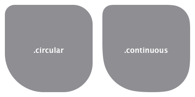

# EnhancedRoundedRectangle

A reimplementation of SwiftUI's `RoundedRectangle` with support for non-uniform corner radii.

## Usage

```swift
EnhancedRoundedRectangle(
    cornerRadius: .init(
        topLeft: 10.0,
        topRight: 20.0,
        bottomRight: 30.0,
        bottomLeft: 40.0
    ),
    style: .circular // .continuous
)
.fill(Color.gray)
.frame(width: 100.0, height: 100.0)
```



## Installation

To use **EnhancedRoundedRectangle** to your project add this line to your `Package.swift` file:

```swift
.package(
    url: "https://github.com/regexident/EnhancedRoundedRectangle",
    from: "<your desired version>"
),
```

## License

**EnhancedRoundedRectangle** is available under a **MPL-2 license**. See the `LICENSE` file for more info.

## Contributing

Unless you explicitly state otherwise, any contribution intentionally submitted for inclusion in the work by you shall be licensed as above, without any additional terms or conditions.
